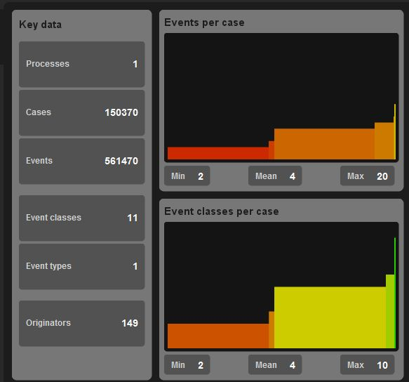
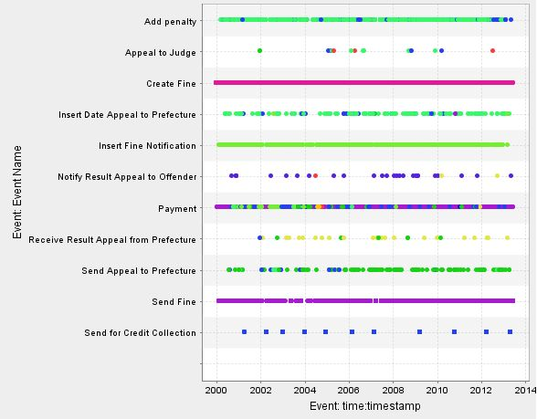
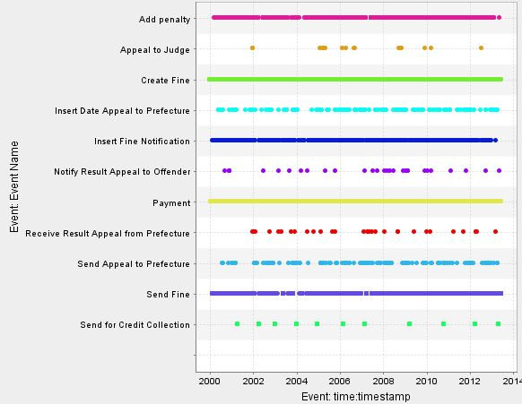
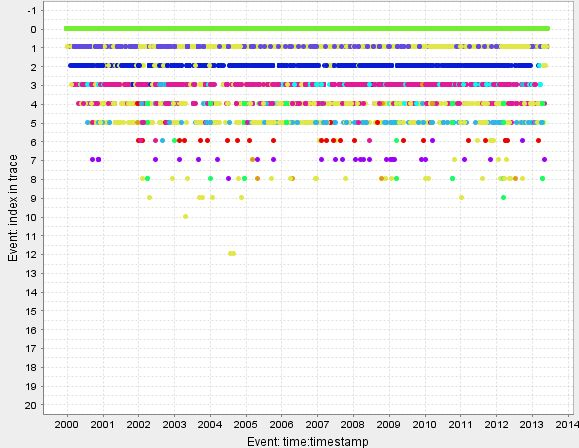
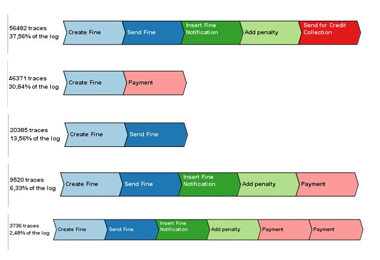
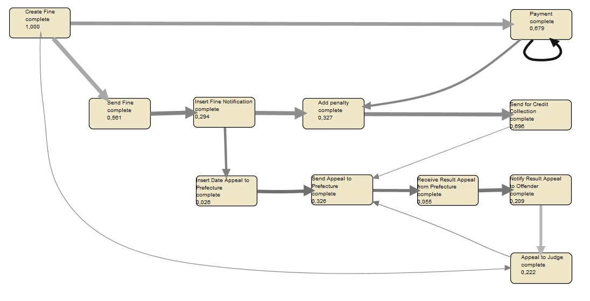
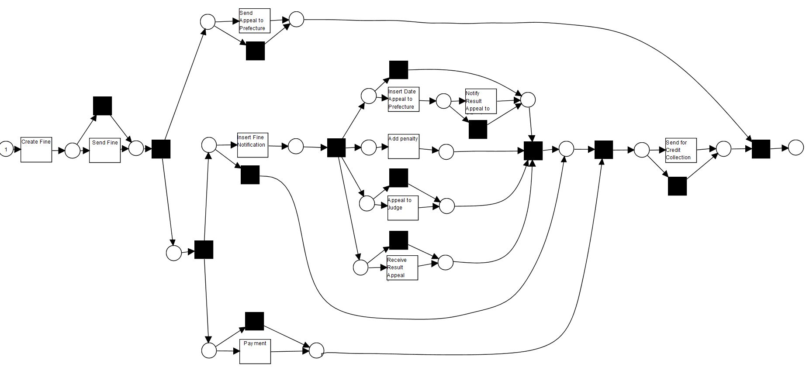

# Process analysis with ProM#

Author:  W.Dijkhuis   
Date:  august 2016   

## introduction

This report documents the use of [ProM Lite](http://www.promtools.org/doku.php?id=promlite11) to explore and analyse process behaviour and to find the process structure.  
The analysis is a mini project that was suggested by the authors of the TUe/FutureLearn MOOC [Introduction to Process Mining with ProM](https://www.futurelearn.com/courses/process-mining). 

The data consist of an event log,  recording the processing of traffic fines issued by the Italian police.  
Beyond that, no information about the process was given.   
All other information had to be deduced from the data in the event-log.

.

## 1 - data acquisition

The data were collected by the authors of the MOOC in a file Road_Traffic_Fine_Management_Process.xes.gz  
The data were already correctly formatted to be used in ProM.  
The file could be downloaded from the internet.  

.
 
## 2 -  data exploration

The the ProM log visualizer gives the following overview

#### figure 1 - log visualizer results

 

Here we read:

- there are 150,370 traces (i.e.fines that are processed)
- there are 11 event classes (i.e. different steps in the processing of fines)
- there are between 2 and 20 events processed per trace
- there are between 2 and 10 different event classes per occurring in traces.
- some event classes reoccur within a trace (so there are loops in the process) 

#### figure 2a - dotted chart: event name by time (colour represents index)

 

Here we read:

- The data were collected between 2000 and 2013 (so we have about fourteen years of data).
- There are 11 event types, 
provisionally reordered and grouped these are: 
	- a: create fine
	- b: send fine 
	- c: insert fine notification
	- d: add penalty (optional, occurs for late payment?)
	- e: payment
	- = = = = =
	- f: send appeal to prefecture
	- g: insert date appeal to prefecture 
	- h: receive results appeal to prefecture
	- i: notify results appeal to offender
	- j: appeal to judge
	- = = = =
	- k: send for credit collection
- the events a, b and c almost always occur (their dotted lines are solid) 
- the lines a, b, c lines have constant colour. The colour represents the index of the event in the trace (is it the first, second, third, etc. event in the trace). So the a, b and c are processed in a fixed sequence (probably a->b->c)
- The line for event e -payment- is solid, so most fines are paid in the end. The line for k "send for credit collection" only contain a few dots, this supports the idea of frequent payment. 
- The e line is multicoloured, so payment has not a fixed index (can occur as the fourth, the fifth, the sixth etc. step in the process).
- probably e is the last step in most traces.
- the d line for "add penalty" is solid also; that would means that this occurs frequently.       

Figure 2a was coloured by index position.   
If we colour by event name we get figure 2b.   
Here we can see which colour will represents which event in figure 2c .

#### figure 2b - dotted chart: colour per event name (colour represents event name)

 

Now we can create figure 2c.

#### figure 2c - dotted chart: index by time (colour represents event name)

 

Here we read:

- The hypnotised standard sequence a->b->c-(d)->e indeed occurs in that order (i.e. in index positions 0,1,2,3 and 4).
- Some fines are paid early (traces a->e and a->b->e also occur)
- legal appeal events occur not that often, when they occur at index 4, 6, 7 or 8.

Probably we can distinguish two types of normal cases  
1) cases without appeal (containing only events a,b,c,d,e and k)   
2) cases with appeal (also containing f,g,h,i and j)  

Note that figure 2c has strange features.
- the maximum event index is 20 (figure 1 showed that the maximum number of events per case was 20, so that is consistent). However figure 2c has a maximum index of 12. No cases with index 13 or higher occur. This can only be explained by assuming that the figures do not show the whole data set, but only a sample.
- there are two cases that have index 12 but have no index 11.      

Figure 2d shows how cases are processed in time. On the horizontal axis the trace index is displayed (first trace in the file, second third etc.)
     
The explore event log (trace variants) visualization option provides and easy way to find typical way to go trough the process. Figure 3 shows the five most common trace types.

#### figure 3 -  the five most common traces

 

Here we read:

- the five most common traces cover over 90% of cases.
- None of these five involve going to court.
- Only about 40% of cases end with payment
- Alarmingly 50% of cases end in non payment  
(are these cases still in progress? or "lost" in the system?)
- the hypothesised order a->b->c->(d)->e sequence is clearly visible.
- it is possible to pay in instalments.

The "mine for fuzzy model" plug-in can produce a simple preliminary process model.  
After the (laborious!) intervention of changing the layout by hand the result can look as in figure 4. 

#### Figure 4a - a preliminary process model

 

The model has several remarkable features.

To start with it is not clear what the possible end-states of the process are. One possible interpretation is:

- The process ends when the fine is paid in one ore more instalments.   
However even after payment, a penalty can be added  (if the fine is not fully paid on time?).     
So one way the process can end is paying fully on time.   
From figure 3 we know that about 30% of cases end like this.
- The last step in the process can also be the "Send for credit collection complete".   
Note that for the offender the case has not ended yet, but the police has handed the "problem" over to the credit collecting authority, so the police has done its work, for them the case is closed.  
From figure 3 we know that about 38% of cases end like this. 
- A case can also end after appeal to the Prefecture (if the appeal is granted and the offender notified).   
If the appeal is not granted the offender can appeal to a Judge.  
It is not clear what happens when the first appeal is not granted and the offender does not appeal to a judge.
- Finally a case can end when a judge grants an appeal. 

Secondly, from figure 3 we know that about 10% of cases end in "add penalty" followed by "payment".  
The process model in figure 4 does not allow for this possibility at all.  
(maybe the arc between "payment" and "add penalty" should point the other way?).

Thirdly, from figure 3 we know that almost 14% of cases consists of "create fine" followed by "send fine" and nothing else. The logical next step "insert fine notification" is missing. One possible explanation would be that the notification is sent to an address where the offender is unknown. The notification can not be delivered, the fine is non-collectable, the process ends here. If that were the case there should be an activity "insert fine is not notable". Maybe the designers of the event log forgot to record this activity.   

**Note** the event-log is not the only possible source of information.  
Subject matter experts can probably solve most problems we encountered.

The "mine Petri net with inductive miner" option can produce an somewhat more detailed preliminary model.

#### Figure 4b - a preliminary Petri-net process model

 

The model has several remarkable features.

First all activities except "create fine" and "add penalty" can be bypassed/skipped (there is a black box directly parallel to those activity). 

Second It is even possible that the whole process consist of only the first step "create fine" (follow the "uppermost" path trough the graph).

.

## 3 - data filtering

   